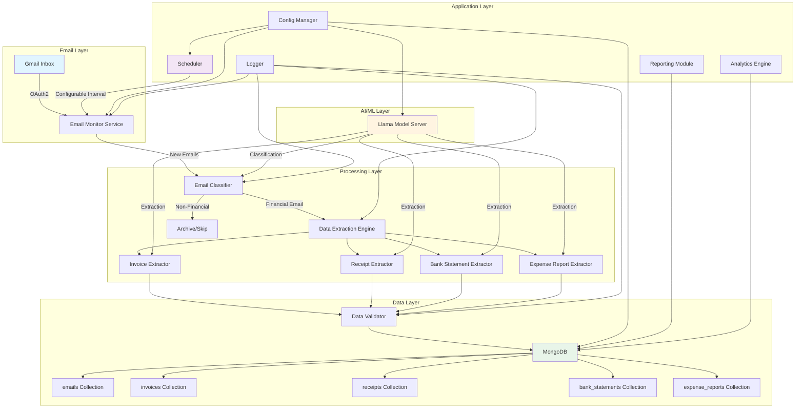
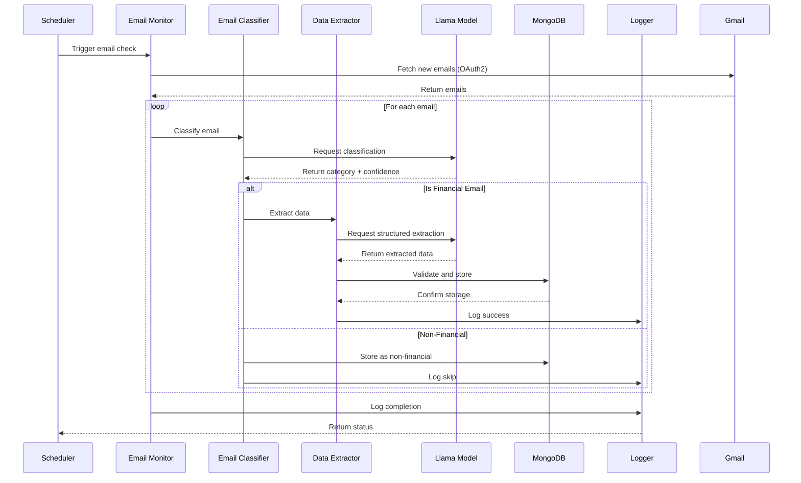
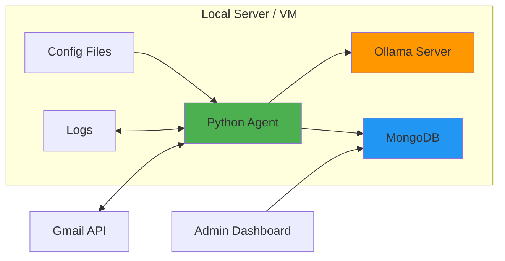

# Financial Email Agent - System Architecture

## Overview
An autonomous AI agent that monitors Gmail inbox, identifies financial emails, extracts structured data using open-source Llama models, and stores information in MongoDB for analysis and reporting.

## System Architecture



## Component Details

### 1. Email Monitor Service
**Purpose**: Continuously monitor Gmail inbox for new emails

**Key Features**:
- OAuth2 authentication with Gmail API
- IMAP connection management
- Email fetching with configurable intervals
- Attachment handling (PDF, images, Excel files)
- Email state tracking (processed/unprocessed)

**Technologies**:
- `google-auth-oauthlib` for OAuth2
- `google-api-python-client` for Gmail API
- `imaplib` as fallback for IMAP

### 2. Email Classifier
**Purpose**: Identify emails containing financial data

**Classification Categories**:
- Invoice
- Receipt
- Bank Statement
- Expense Report
- Non-Financial (ignore)

**Features**:
- Subject line analysis
- Sender domain analysis
- Email body content analysis
- Attachment type detection
- Confidence scoring

**AI Model**: Llama 3.1 (8B or 13B) for text classification

### 3. Data Extraction Engine
**Purpose**: Extract structured information from financial documents

**Extraction Modules**:

#### Invoice Extractor
- Vendor name and details
- Invoice number and date
- Due date
- Line items (description, quantity, unit price, total)
- Subtotal, tax, total amount
- Payment terms
- Currency

#### Receipt Extractor
- Merchant name and location
- Transaction date and time
- Items purchased
- Payment method
- Total amount
- Tax information
- Receipt number

#### Bank Statement Extractor
- Account number (masked)
- Statement period
- Opening and closing balance
- Transaction list (date, description, debit/credit, balance)
- Interest earned
- Fees charged

#### Expense Report Extractor
- Employee name and ID
- Report period
- Expense categories
- Individual expenses (date, description, amount, category)
- Total expenses
- Approval status

**AI Model**: Llama 3.1 with structured output prompting

### 4. MongoDB Schema

```javascript
// emails collection
{
  _id: ObjectId,
  email_id: String,
  subject: String,
  sender: String,
  received_date: ISODate,
  classification: String,
  confidence_score: Number,
  has_attachments: Boolean,
  attachments: Array,
  processed: Boolean,
  processed_date: ISODate,
  extracted_data_refs: Array
}

// invoices collection
{
  _id: ObjectId,
  email_ref: ObjectId,
  invoice_number: String,
  vendor_name: String,
  vendor_address: String,
  invoice_date: ISODate,
  due_date: ISODate,
  line_items: [
    {
      description: String,
      quantity: Number,
      unit_price: Number,
      total: Number
    }
  ],
  subtotal: Number,
  tax: Number,
  total_amount: Number,
  currency: String,
  payment_terms: String,
  status: String,
  created_at: ISODate,
  updated_at: ISODate
}

// receipts collection
{
  _id: ObjectId,
  email_ref: ObjectId,
  merchant_name: String,
  merchant_location: String,
  transaction_date: ISODate,
  items: Array,
  payment_method: String,
  total_amount: Number,
  tax_amount: Number,
  currency: String,
  receipt_number: String,
  created_at: ISODate
}

// bank_statements collection
{
  _id: ObjectId,
  email_ref: ObjectId,
  account_number_masked: String,
  statement_period_start: ISODate,
  statement_period_end: ISODate,
  opening_balance: Number,
  closing_balance: Number,
  transactions: [
    {
      date: ISODate,
      description: String,
      debit: Number,
      credit: Number,
      balance: Number
    }
  ],
  interest_earned: Number,
  fees_charged: Number,
  currency: String,
  created_at: ISODate
}

// expense_reports collection
{
  _id: ObjectId,
  email_ref: ObjectId,
  employee_name: String,
  employee_id: String,
  report_period_start: ISODate,
  report_period_end: ISODate,
  expenses: [
    {
      date: ISODate,
      description: String,
      amount: Number,
      category: String
    }
  ],
  total_expenses: Number,
  currency: String,
  approval_status: String,
  created_at: ISODate
}
```

### 5. Llama Model Integration

**Model Selection**: Llama 3.1 8B (balance of performance and resource usage)

**Deployment Options**:
1. **Ollama** (Recommended for local deployment)
   - Easy setup and management
   - REST API interface
   - Model caching and optimization

2. **llama.cpp** (Alternative)
   - Lower resource usage
   - CPU-optimized inference

**Prompting Strategy**:
- Few-shot learning with examples
- Structured output format (JSON)
- Chain-of-thought reasoning for complex extractions
- Confidence scoring for validation

### 6. Configuration Management

**config.yaml Structure**:
```yaml
email:
  provider: gmail
  oauth2:
    credentials_file: credentials.json
    token_file: token.json
  monitoring:
    interval_minutes: 15
    max_emails_per_check: 50
  filters:
    unread_only: true
    labels: ["Finance", "Invoices"]

llama:
  model: llama3.1:8b
  api_url: http://localhost:11434
  temperature: 0.1
  max_tokens: 2048
  timeout_seconds: 60

mongodb:
  connection_string: mongodb://localhost:27017
  database: financial_data
  collections:
    emails: emails
    invoices: invoices
    receipts: receipts
    bank_statements: bank_statements
    expense_reports: expense_reports

logging:
  level: INFO
  file: logs/agent.log
  max_size_mb: 100
  backup_count: 5

scheduler:
  enabled: true
  check_interval_minutes: 15
  retry_failed: true
  max_retries: 3

reporting:
  enabled: true
  daily_summary: true
  email_alerts: false
```

## Data Flow



## Security Considerations

1. **OAuth2 Credentials**
   - Store credentials.json securely
   - Encrypt token.json at rest
   - Implement token refresh mechanism
   - Use environment variables for sensitive data

2. **Database Security**
   - Use MongoDB authentication
   - Encrypt connections (TLS/SSL)
   - Implement role-based access control
   - Regular backups with encryption

3. **Data Privacy**
   - Mask sensitive information (account numbers, SSN)
   - Implement data retention policies
   - GDPR/compliance considerations
   - Audit logging for data access

4. **API Security**
   - Rate limiting for Llama API calls
   - Input validation and sanitization
   - Error handling without exposing internals

## Performance Optimization

1. **Email Processing**
   - Batch processing for multiple emails
   - Parallel processing for attachments
   - Caching for frequently accessed data
   - Incremental processing (only new emails)

2. **AI Model Optimization**
   - Model quantization (4-bit or 8-bit)
   - Prompt caching for similar requests
   - Batch inference when possible
   - GPU acceleration if available

3. **Database Optimization**
   - Indexing on frequently queried fields
   - Connection pooling
   - Aggregation pipelines for analytics
   - Sharding for large datasets

## Error Handling & Resilience

1. **Email Connection Failures**
   - Automatic retry with exponential backoff
   - Fallback to IMAP if Gmail API fails
   - Connection pool management

2. **AI Model Failures**
   - Timeout handling
   - Fallback to rule-based extraction
   - Queue failed extractions for retry

3. **Database Failures**
   - Transaction rollback
   - Local caching during outages
   - Automatic reconnection

4. **Data Quality Issues**
   - Validation rules for extracted data
   - Confidence thresholds
   - Manual review queue for low-confidence extractions

## Monitoring & Alerting

**Metrics to Track**:
- Emails processed per hour/day
- Classification accuracy
- Extraction success rate
- Processing time per email
- Database storage growth
- Model inference time
- Error rates by component

**Alerting Conditions**:
- Email connection failures
- Database connection issues
- High error rates (>5%)
- Low confidence scores (<70%)
- Processing delays (>30 minutes)
- Disk space warnings

## Scalability Considerations

**Current Design**: Single-instance Python application

**Future Scaling Options**:
1. **Horizontal Scaling**
   - Multiple agent instances with distributed locking
   - Message queue (RabbitMQ/Redis) for email distribution
   - Load balancing across instances

2. **Vertical Scaling**
   - Larger Llama models (13B, 70B) with better hardware
   - GPU acceleration for faster inference
   - More memory for batch processing

3. **Cloud Migration**
   - Containerization (Docker)
   - Kubernetes orchestration
   - Managed MongoDB (Atlas)
   - Serverless functions for processing

## Technology Stack Summary

**Core Application**:
- Python 3.10+
- APScheduler (scheduling)
- asyncio (async operations)

**Email Integration**:
- google-auth-oauthlib
- google-api-python-client
- email, imaplib (built-in)

**AI/ML**:
- Ollama (Llama model server)
- requests (API calls)
- langchain (optional, for advanced prompting)

**Database**:
- pymongo (MongoDB driver)
- motor (async MongoDB driver)

**Utilities**:
- pydantic (data validation)
- python-dotenv (environment variables)
- PyYAML (configuration)
- loguru (enhanced logging)
- pytest (testing)

**Document Processing**:
- PyPDF2 (PDF extraction)
- python-docx (Word documents)
- openpyxl (Excel files)
- Pillow (image processing)
- pytesseract (OCR for images)

## Deployment Architecture



## Next Steps

1. Set up development environment
2. Implement core modules iteratively
3. Test with sample emails
4. Fine-tune Llama prompts for accuracy
5. Deploy and monitor in production
6. Iterate based on performance metrics
