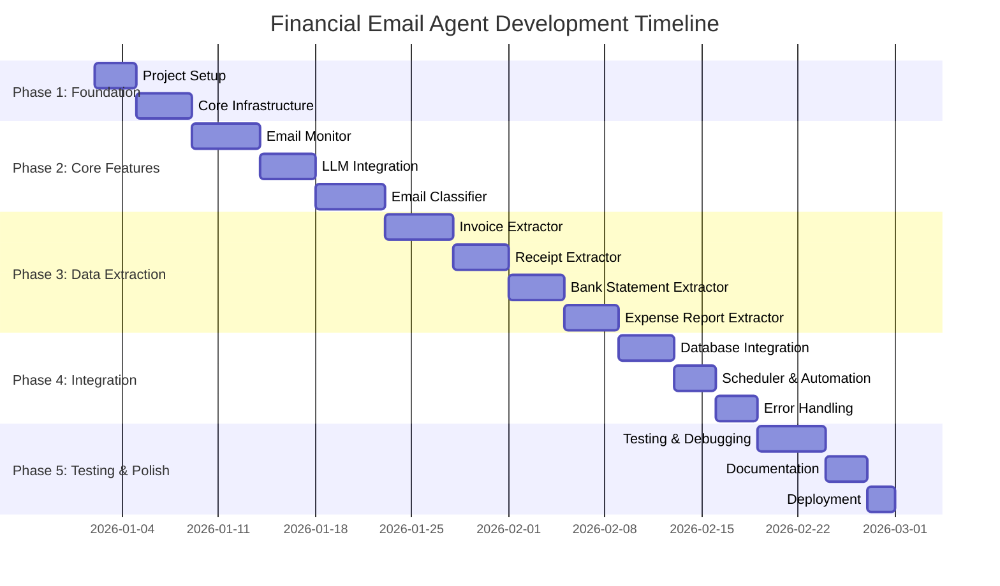

# Financial Email Agent - Implementation Plan

## Project Overview

**Goal:** Build an autonomous AI agent that monitors Gmail, classifies financial emails, extracts structured data using Llama 3.2:3b, and stores it in MongoDB Atlas.

**Architecture:** Cloud-based with remote LLM (Open WebUI) and MongoDB Atlas

**Timeline:** 6-8 weeks for MVP, 10-12 weeks for full implementation

---

## Implementation Phases

### Timeline Overview



---

## Phase 1: Foundation & Setup (Week 1)

### Milestone 1.1: Project Initialization
**Duration:** 1 day

**Tasks:**
- [ ] Create project directory structure
- [ ] Initialize Git repository
- [ ] Set up virtual environment
- [ ] Create requirements.txt
- [ ] Install core dependencies
- [ ] Create .gitignore and .env files

**Deliverables:**
- Complete project structure
- Working virtual environment
- All dependencies installed

**Project Structure:**
```
financial-email-agent/
├── src/
│   ├── __init__.py
│   ├── email_monitor/
│   │   └── __init__.py
│   ├── classifier/
│   │   └── __init__.py
│   ├── extractors/
│   │   └── __init__.py
│   ├── database/
│   │   └── __init__.py
│   ├── models/
│   │   └── __init__.py
│   ├── utils/
│   │   └── __init__.py
│   └── pipeline/
│       └── __init__.py
├── config/
│   ├── config.yaml
│   ├── .env.template
│   └── .env
├── credentials/
│   └── .gitkeep
├── logs/
│   └── .gitkeep
├── tests/
│   ├── unit/
│   ├── integration/
│   └── e2e/
├── docs/
│   ├── architecture.md
│   └── implementation-plan.md
├── requirements.txt
├── .gitignore
├── README.md
└── setup.sh
```

---

### Milestone 1.2: Configuration Management
**Duration:** 1 day

**Tasks:**
- [ ] Create configuration models using Pydantic
- [ ] Implement config loader from YAML and .env
- [ ] Create settings validation
- [ ] Set up logging configuration
- [ ] Create configuration documentation

**Deliverables:**
- `src/utils/config.py` - Configuration loader
- `src/models/config_models.py` - Pydantic models
- `config/config.yaml` - Default configuration

**Key Components:**
```python
# src/models/config_models.py
from pydantic import BaseModel, Field
from typing import Optional

class MongoDBConfig(BaseModel):
    uri: str
    database: str
    timeout: int = 10000

class LLMConfig(BaseModel):
    api_url: str
    api_key: Optional[str] = None
    model: str = "llama3.2:3b"
    temperature: float = 0.1
    max_tokens: int = 2048
    timeout: int = 120

class GmailConfig(BaseModel):
    credentials_path: str
    token_path: str
    check_interval_minutes: int = 15
    max_emails_per_check: int = 50
    unread_only: bool = True

class LoggingConfig(BaseModel):
    level: str = "INFO"
    file: str = "logs/agent.log"
    max_size_mb: int = 100
    backup_count: int = 5

class AppConfig(BaseModel):
    mongodb: MongoDBConfig
    llm: LLMConfig
    gmail: GmailConfig
    logging: LoggingConfig
```

---

### Milestone 1.3: Core Infrastructure
**Duration:** 1 day

**Tasks:**
- [ ] Set up logging system with Loguru
- [ ] Create database connection manager
- [ ] Create LLM client wrapper
- [ ] Implement retry logic and error handling
- [ ] Create utility functions

**Deliverables:**
- `src/utils/logger.py` - Logging setup
- `src/database/connection.py` - MongoDB connection
- `src/utils/llm_client.py` - LLM client
- `src/utils/helpers.py` - Utility functions

**Logger Setup:**
```python
# src/utils/logger.py
from loguru import logger
import sys

def setup_logger(config: LoggingConfig):
    logger.remove()
    logger.add(
        sys.stderr,
        level=config.level,
        format="<green>{time:YYYY-MM-DD HH:mm:ss}</green> | <level>{level: <8}</level> | <cyan>{name}</cyan>:<cyan>{function}</cyan> - <level>{message}</level>"
    )
    logger.add(
        config.file,
        rotation=f"{config.max_size_mb} MB",
        retention=config.backup_count,
        level=config.level
    )
    return logger
```

---

## Phase 2: Core Features (Weeks 2-3)

### Milestone 2.1: Email Monitor Service
**Duration:** 5 days

**Tasks:**
- [ ] Implement Gmail OAuth2 authentication
- [ ] Create email fetching service
- [ ] Implement email parsing (subject, body, sender)
- [ ] Add attachment handling (download and store)
- [ ] Create email state tracking
- [ ] Add unit tests

**Deliverables:**
- `src/email_monitor/auth.py` - OAuth2 authentication
- `src/email_monitor/gmail_client.py` - Gmail API client
- `src/email_monitor/email_parser.py` - Email parsing
- `src/models/email_models.py` - Email data models
- `tests/unit/test_email_monitor.py` - Unit tests

**Key Features:**
```python
# src/email_monitor/gmail_client.py
from google.oauth2.credentials import Credentials
from googleapiclient.discovery import build
from typing import List, Optional

class GmailClient:
    def __init__(self, credentials: Credentials):
        self.service = build('gmail', 'v1', credentials=credentials)
    
    def authenticate(self) -> Credentials:
        """Authenticate with Gmail using OAuth2"""
        pass
    
    def fetch_unread_emails(self, max_results: int = 50) -> List[Email]:
        """Fetch unread emails from inbox"""
        pass
    
    def get_email_by_id(self, email_id: str) -> Email:
        """Get specific email by ID"""
        pass
    
    def download_attachment(self, email_id: str, attachment_id: str) -> bytes:
        """Download email attachment"""
        pass
    
    def mark_as_read(self, email_id: str) -> bool:
        """Mark email as read"""
        pass
```

**Email Data Model:**
```python
# src/models/email_models.py
from pydantic import BaseModel, EmailStr
from datetime import datetime
from typing import List, Optional

class Attachment(BaseModel):
    filename: str
    mime_type: str
    size: int
    attachment_id: str
    data: Optional[bytes] = None

class Email(BaseModel):
    email_id: str
    subject: str
    sender: EmailStr
    received_date: datetime
    body_text: str
    body_html: Optional[str] = None
    has_attachments: bool = False
    attachments: List[Attachment] = []
    labels: List[str] = []
```

---

### Milestone 2.2: LLM Integration
**Duration:** 4 days

**Tasks:**
- [ ] Create LLM client for Open WebUI
- [ ] Implement prompt templates
- [ ] Add response parsing and validation
- [ ] Implement retry logic with exponential backoff
- [ ] Create prompt engineering utilities
- [ ] Add integration tests

**Deliverables:**
- `src/utils/llm_client.py` - Enhanced LLM client
- `src/utils/prompts.py` - Prompt templates
- `src/utils/response_parser.py` - Response parsing
- `tests/integration/test_llm_integration.py` - Integration tests

**LLM Client:**
```python
# src/utils/llm_client.py
import requests
from typing import Dict, Any, Optional
from tenacity import retry, stop_after_attempt, wait_exponential

class LLMClient:
    def __init__(self, config: LLMConfig):
        self.api_url = config.api_url
        self.api_key = config.api_key
        self.model = config.model
        self.timeout = config.timeout
        self.temperature = config.temperature
        self.max_tokens = config.max_tokens
        
        self.headers = {'Content-Type': 'application/json'}
        if self.api_key:
            self.headers['Authorization'] = f'Bearer {self.api_key}'
    
    @retry(stop=stop_after_attempt(3), wait=wait_exponential(multiplier=1, min=4, max=10))
    def generate(self, prompt: str, system_prompt: Optional[str] = None) -> str:
        """Generate text using the LLM with retry logic"""
        payload = {
            'model': self.model,
            'messages': [],
            'temperature': self.temperature,
            'max_tokens': self.max_tokens,
            'stream': False
        }
        
        if system_prompt:
            payload['messages'].append({'role': 'system', 'content': system_prompt})
        
        payload['messages'].append({'role': 'user', 'content': prompt})
        
        response = requests.post(
            f'{self.api_url}/chat/completions',
            json=payload,
            headers=self.headers,
            timeout=self.timeout
        )
        response.raise_for_status()
        
        result = response.json()
        return result['choices'][0]['message']['content']
```

**Prompt Templates:**
```python
# src/utils/prompts.py

CLASSIFICATION_PROMPT = """
You are an email classifier specialized in financial documents.

Classify this email into ONE of these categories:
- invoice: Bills, invoices from vendors
- receipt: Purchase receipts, transaction confirmations
- bank_statement: Bank account statements, transaction summaries
- expense_report: Employee expense reports, reimbursement requests
- non_financial: Any other type of email

Email Details:
Subject: {subject}
From: {sender}
Body Preview: {body}

Return ONLY valid JSON in this exact format:
{{"category": "invoice|receipt|bank_statement|expense_report|non_financial", "confidence": 0.95}}

The confidence should be between 0.0 and 1.0.
"""

INVOICE_EXTRACTION_PROMPT = """
Extract structured information from this invoice email.

Email Content:
{content}

Extract and return ONLY valid JSON with these fields:
{{
  "vendor_name": "Company name",
  "vendor_address": "Full address or null",
  "invoice_number": "Invoice number",
  "invoice_date": "YYYY-MM-DD",
  "due_date": "YYYY-MM-DD or null",
  "line_items": [
    {{"description": "Item", "quantity": 1, "unit_price": 100.00, "total": 100.00}}
  ],
  "subtotal": 100.00,
  "tax": 10.00,
  "total_amount": 110.00,
  "currency": "USD",
  "payment_terms": "Net 30 or null"
}}

Use null for missing fields. Ensure all numbers are valid decimals.
"""

RECEIPT_EXTRACTION_PROMPT = """
Extract structured information from this receipt.

Receipt Content:
{content}

Return ONLY valid JSON:
{{
  "merchant_name": "Store name",
  "merchant_location": "Address or null",
  "transaction_date": "YYYY-MM-DD HH:MM:SS",
  "items": ["item1", "item2"],
  "payment_method": "Credit Card/Cash/etc",
  "total_amount": 50.00,
  "tax_amount": 5.00,
  "currency": "USD",
  "receipt_number": "Receipt ID or null"
}}
"""
```

---

### Milestone 2.3: Email Classifier
**Duration:** 5 days

**Tasks:**
- [ ] Implement classification logic using LLM
- [ ] Create confidence scoring system
- [ ] Add fallback rule-based classification
- [ ] Implement classification caching
- [ ] Create classification reports
- [ ] Add comprehensive tests

**Deliverables:**
- `src/classifier/email_classifier.py` - Main classifier
- `src/classifier/rules.py` - Rule-based fallback
- `src/models/classification_models.py` - Data models
- `tests/unit/test_classifier.py` - Unit tests

**Classifier Implementation:**
```python
# src/classifier/email_classifier.py
from typing import Optional
import json
from loguru import logger

class EmailClassifier:
    def __init__(self, llm_client: LLMClient, confidence_threshold: float = 0.7):
        self.llm_client = llm_client
        self.confidence_threshold = confidence_threshold
        self.rule_classifier = RuleBasedClassifier()
    
    def classify(self, email: Email) -> Classification:
        """Classify email using LLM with fallback to rules"""
        try:
            # Try LLM classification
            classification = self._classify_with_llm(email)
            
            # If confidence is low, use rule-based fallback
            if classification.confidence < self.confidence_threshold:
                logger.warning(f"Low confidence ({classification.confidence}), using rule-based fallback")
                rule_classification = self.rule_classifier.classify(email)
                
                # Use rule-based if it has higher confidence
                if rule_classification.confidence > classification.confidence:
                    classification = rule_classification
            
            return classification
            
        except Exception as e:
            logger.error(f"LLM classification failed: {e}, using rule-based fallback")
            return self.rule_classifier.classify(email)
    
    def _classify_with_llm(self, email: Email) -> Classification:
        """Classify using LLM"""
        prompt = CLASSIFICATION_PROMPT.format(
            subject=email.subject,
            sender=email.sender,
            body=email.body_text[:500]  # First 500 chars
        )
        
        response = self.llm_client.generate(prompt)
        result = json.loads(response)
        
        return Classification(
            category=result['category'],
            confidence=result['confidence'],
            method='llm'
        )
```

**Rule-Based Fallback:**
```python
# src/classifier/rules.py
import re
from typing import Dict

class RuleBasedClassifier:
    def __init__(self):
        self.rules = {
            'invoice': {
                'keywords': ['invoice', 'bill', 'payment due', 'amount due'],
                'sender_domains': ['billing', 'invoices', 'accounts'],
                'confidence': 0.8
            },
            'receipt': {
                'keywords': ['receipt', 'purchase', 'order confirmation', 'transaction'],
                'sender_domains': ['noreply', 'orders', 'receipts'],
                'confidence': 0.75
            },
            'bank_statement': {
                'keywords': ['statement', 'account summary', 'transaction history'],
                'sender_domains': ['bank', 'banking', 'statements'],
                'confidence': 0.85
            },
            'expense_report': {
                'keywords': ['expense report', 'reimbursement', 'expense claim'],
                'sender_domains': ['hr', 'finance', 'expenses'],
                'confidence': 0.8
            }
        }
    
    def classify(self, email: Email) -> Classification:
        """Classify using keyword and sender rules"""
        scores = {}
        
        for category, rules in self.rules.items():
            score = 0
            
            # Check keywords in subject and body
            text = f"{email.subject} {email.body_text}".lower()
            for keyword in rules['keywords']:
                if keyword in text:
                    score += 1
            
            # Check sender domain
            sender_domain = email.sender.split('@')[1].lower()
            for domain in rules['sender_domains']:
                if domain in sender_domain:
                    score += 2
            
            scores[category] = score
        
        # Get category with highest score
        if max(scores.values()) > 0:
            category = max(scores, key=scores.get)
            confidence = self.rules[category]['confidence'] * (scores[category] / 5)
            return Classification(category=category, confidence=min(confidence, 1.0), method='rules')
        
        return Classification(category='non_financial', confidence=0.5, method='rules')
```

---

## Phase 3: Data Extraction (Weeks 4-5)

### Milestone 3.1: Invoice Extractor
**Duration:** 5 days

**Tasks:**
- [ ] Design invoice data schema
- [ ] Create LLM prompts for invoice extraction
- [ ] Implement invoice parser
- [ ] Add data validation rules
- [ ] Handle multiple invoice formats
- [ ] Create extraction tests with sample invoices

**Deliverables:**
- `src/extractors/invoice_extractor.py` - Invoice extraction
- `src/models/invoice_models.py` - Invoice schema
- `src/extractors/validators.py` - Data validators
- `tests/unit/test_invoice_extractor.py` - Tests with samples

**Invoice Data Model:**
```python
# src/models/invoice_models.py
from pydantic import BaseModel, Field, validator
from datetime import date
from decimal import Decimal
from typing import List, Optional

class LineItem(BaseModel):
    description: str
    quantity: Decimal
    unit_price: Decimal
    total: Decimal
    
    @validator('total')
    def validate_total(cls, v, values):
        if 'quantity' in values and 'unit_price' in values:
            expected = values['quantity'] * values['unit_price']
            if abs(v - expected) > 0.01:
                raise ValueError(f"Total {v} doesn't match quantity * unit_price")
        return v

class Invoice(BaseModel):
    email_ref: str
    vendor_name: str
    vendor_address: Optional[str] = None
    invoice_number: str
    invoice_date: date
    due_date: Optional[date] = None
    line_items: List[LineItem]
    subtotal: Decimal
    tax: Decimal
    total_amount: Decimal
    currency: str = "USD"
    payment_terms: Optional[str] = None
    
    @validator('total_amount')
    def validate_total(cls, v, values):
        if 'subtotal' in values and 'tax' in values:
            expected = values['subtotal'] + values['tax']
            if abs(v - expected) > 0.01:
                raise ValueError(f"Total {v} doesn't match subtotal + tax")
        return v
```

**Invoice Extractor:**
```python
# src/extractors/invoice_extractor.py
import json
from decimal import Decimal
from loguru import logger

class InvoiceExtractor:
    def __init__(self, llm_client: LLMClient):
        self.llm_client = llm_client
    
    def extract(self, email: Email) -> Optional[Invoice]:
        """Extract invoice data from email"""
        try:
            # Prepare content (email body + attachments)
            content = self._prepare_content(email)
            
            # Generate extraction prompt
            prompt = INVOICE_EXTRACTION_PROMPT.format(content=content)
            
            # Get LLM response
            response = self.llm_client.generate(prompt)
            
            # Parse JSON response
            data = json.loads(response)
            
            # Convert to Invoice model (validates data)
            invoice = Invoice(
                email_ref=email.email_id,
                **data
            )
            
            logger.info(f"Successfully extracted invoice: {invoice.invoice_number}")
            return invoice
            
        except Exception as e:
            logger.error(f"Invoice extraction failed: {e}")
            return None
    
    def _prepare_content(self, email: Email) -> str:
        """Prepare email content for extraction"""
        content = f"Subject: {email.subject}\n\n"
        content += f"Body:\n{email.body_text}\n\n"
        
        # Add attachment text if available
        for attachment in email.attachments:
            if attachment.mime_type == 'application/pdf':
                # Extract text from PDF
                text = self._extract_pdf_text(attachment.data)
                content += f"\nAttachment ({attachment.filename}):\n{text}\n"
        
        return content[:4000]  # Limit content size
```

---

### Milestone 3.2: Receipt Extractor
**Duration:** 4 days

**Tasks:**
- [ ] Design receipt data schema
- [ ] Create receipt extraction prompts
- [ ] Implement receipt parser
- [ ] Add OCR support for image receipts
- [ ] Handle various receipt formats
- [ ] Create tests with sample receipts

**Deliverables:**
- `src/extractors/receipt_extractor.py` - Receipt extraction
- `src/models/receipt_models.py` - Receipt schema
- `src/utils/ocr_handler.py` - OCR processing
- `tests/unit/test_receipt_extractor.py` - Tests

**Receipt Model:**
```python
# src/models/receipt_models.py
from pydantic import BaseModel
from datetime import datetime
from decimal import Decimal
from typing import List, Optional

class Receipt(BaseModel):
    email_ref: str
    merchant_name: str
    merchant_location: Optional[str] = None
    transaction_date: datetime
    items: List[str] = []
    payment_method: str
    total_amount: Decimal
    tax_amount: Decimal
    currency: str = "USD"
    receipt_number: Optional[str] = None
```

---

### Milestone 3.3: Bank Statement Extractor
**Duration:** 4 days

**Tasks:**
- [ ] Design bank statement schema
- [ ] Create extraction prompts for statements
- [ ] Implement transaction parser
- [ ] Add balance reconciliation
- [ ] Handle PDF and Excel formats
- [ ] Create tests with sample statements

**Deliverables:**
- `src/extractors/bank_statement_extractor.py`
- `src/models/bank_statement_models.py`
- `tests/unit/test_bank_statement_extractor.py`

**Bank Statement Model:**
```python
# src/models/bank_statement_models.py
from pydantic import BaseModel
from datetime import date
from decimal import Decimal
from typing import List

class Transaction(BaseModel):
    date: date
    description: str
    debit: Decimal = Decimal('0')
    credit: Decimal = Decimal('0')
    balance: Decimal

class BankStatement(BaseModel):
    email_ref: str
    account_number_masked: str
    statement_period_start: date
    statement_period_end: date
    opening_balance: Decimal
    closing_balance: Decimal
    transactions: List[Transaction]
    interest_earned: Decimal = Decimal('0')
    fees_charged: Decimal = Decimal('0')
    currency: str = "USD"
```

---

### Milestone 3.4: Expense Report Extractor
**Duration:** 4 days

**Tasks:**
- [ ] Design expense report schema
- [ ] Create extraction prompts
- [ ] Implement expense parser
- [ ] Add category classification
- [ ] Handle various report formats
- [ ] Create tests with sample reports

**Deliverables:**
- `src/extractors/expense_report_extractor.py`
- `src/models/expense_report_models.py`
- `tests/unit/test_expense_report_extractor.py`

**Expense Report Model:**
```python
# src/models/expense_report_models.py
from pydantic import BaseModel
from datetime import date
from decimal import Decimal
from typing import List

class Expense(BaseModel):
    date: date
    description: str
    amount: Decimal
    category: str

class ExpenseReport(BaseModel):
    email_ref: str
    employee_name: str
    employee_id: Optional[str] = None
    report_period_start: date
    report_period_end: date
    expenses: List[Expense]
    total_expenses: Decimal
    currency: str = "USD"
    approval_status: str = "pending"
```

---

## Phase 4: Integration & Automation (Week 6)

### Milestone 4.1: Database Integration
**Duration:** 4 days

**Tasks:**
- [ ] Create MongoDB repository classes
- [ ] Implement CRUD operations for all collections
- [ ] Add indexing for performance
- [ ] Create data migration scripts
- [ ] Implement transaction support
- [ ] Add database tests

**Deliverables:**
- `src/database/repositories.py` - Repository pattern
- `src/database/models.py` - MongoDB models
- `src/database/migrations.py` - Migration scripts
- `tests/unit/test_database.py` - Database tests

**Repository Pattern:**
```python
# src/database/repositories.py
from pymongo import MongoClient
from typing import Optional, List
from datetime import datetime

class BaseRepository:
    def __init__(self, db, collection_name: str):
        self.collection = db[collection_name]
    
    def create(self, data: dict) -> str:
        """Insert document and return ID"""
        result = self.collection.insert_one(data)
        return str(result.inserted_id)
    
    def find_by_id(self, doc_id: str) -> Optional[dict]:
        """Find document by ID"""
        from bson import ObjectId
        return self.collection.find_one({'_id': ObjectId(doc_id)})
    
    def update(self, doc_id: str, data: dict) -> bool:
        """Update document"""
        from bson import ObjectId
        result = self.collection.update_one(
            {'_id': ObjectId(doc_id)},
            {'$set': data}
        )
        return result.modified_count > 0
    
    def delete(self, doc_id: str) -> bool:
        """Delete document"""
        from bson import ObjectId
        result = self.collection.delete_one({'_id': ObjectId(doc_id)})
        return result.deleted_count > 0

class EmailRepository(BaseRepository):
    def __init__(self, db):
        super().__init__(db, 'emails')
        self._create_indexes()
    
    def _create_indexes(self):
        """Create indexes for performance"""
        self.collection.create_index('email_id', unique=True)
        self.collection.create_index('processed')
        self.collection.create_index('received_date')
        self.collection.create_index('classification')
    
    def find_unprocessed(self, limit: int = 50) -> List[dict]:
        """Find unprocessed emails"""
        return list(self.collection.find(
            {'processed': False}
        ).limit(limit))
    
    def mark_as_processed(self, email_id: str) -> bool:
        """Mark email as processed"""
        result = self.collection.update_one(
            {'email_id': email_id},
            {'$set': {
                'processed': True,
                'processed_date': datetime.utcnow()
            }}
        )
        return result.modified_count > 0

class InvoiceRepository(BaseRepository):
    def __init__(self, db):
        super().__init__(db, 'invoices')
        self._create_indexes()
    
    def _create_indexes(self):
        self.collection.create_index('invoice_number')
        self.collection.create_index('vendor_name')
        self.collection.create_index('invoice_date')
        self.collection.create_index('email_ref')
```

---

### Milestone 4.2: Scheduler & Automation
**Duration:** 3 days

**Tasks:**
- [ ] Implement APScheduler integration
- [ ] Create main processing pipeline
- [ ] Add job scheduling and management
- [ ] Implement graceful shutdown
- [ ] Add monitoring and health checks
- [ ] Create scheduler tests

**Deliverables:**
- `src/scheduler/job_scheduler.py` - Scheduler
- `src/pipeline/processor.py` - Main pipeline
- `src/main.py` - Application entry point
- `tests/unit/test_scheduler.py` - Tests

**Main Processing Pipeline:**
```python
# src/pipeline/processor.py
from loguru import logger

class EmailProcessor:
    def __init__(
        self,
        gmail_client: GmailClient,
        classifier: EmailClassifier,
        extractors: dict,
        repositories: dict
    ):
        self.gmail_client = gmail_client
        self.classifier = classifier
        self.extractors = extractors
        self.repositories = repositories
    
    def process_emails(self):
        """Main processing pipeline"""
        logger.info("Starting email processing cycle")
        
        try:
            # 1. Fetch new emails
            emails = self.gmail_client.fetch_unread_emails()
            logger.info(f"Fetched {len(emails)} unread emails")
            
            # 2. Process each email
            for email in emails:
                self._process_single_email(email)
            
            logger.info("Email processing cycle completed")
            
        except Exception as e:
            logger.error(f"Email processing failed: {e}")
    
    def _process_single_email(self, email: Email):
        """Process a single email"""
        try:
            # Store email
            email_id = self.repositories['email'].create(email.dict())
            
            # Classify email
            classification = self.classifier.classify(email)
            logger.info(f"Email classified as: {classification.category} (confidence: {classification.confidence})")
            
            # Update email with classification
            self.repositories['email'].update(email_id, {
                'classification': classification.category,
                'confidence_score': classification.confidence
            })
            
            # If financial, extract data
            if classification.category != 'non_financial':
                extracted_data = self._extract_data(email, classification.category)
                
                if extracted_data:
                    # Store extracted data
                    repo = self.repositories[classification.category]
                    data_id = repo.create(extracted_data.dict())
                    
                    # Link to email
                    self.repositories['email'].update(email_id, {
                        'extracted_data_ref': data_id
                    })
            
            # Mark as processed
            self.repositories['email'].mark_as_processed(email.email_id)
            self.gmail_client.mark_as_read(email.email_id)
            
        except Exception as e:
            logger.error(f"Failed to process email {email.email_id}: {e}")
    
    def _extract_data(self, email: Email, category: str):
        """Extract data based on category"""
        extractor = self.extractors.get(category)
        if extractor:
            return extractor.extract(email)
        return None
```

**Scheduler:**
```python
# src/scheduler/job_scheduler.py
from apscheduler.schedulers.blocking import BlockingScheduler
from apscheduler.triggers.interval import IntervalTrigger
from loguru import logger

class JobScheduler:
    def __init__(self, processor: EmailProcessor, interval_minutes: int = 15):
        self.processor = processor
        self.interval_minutes = interval_minutes
        self.scheduler = BlockingScheduler()
    
    def start(self):
        """Start the scheduler"""
        logger.info(f"Starting scheduler with {self.interval_minutes} minute interval")
        
        # Add job
        self.scheduler.add_job(
            self.processor.process_emails,
            trigger=IntervalTrigger(minutes=self.interval_minutes),
            id='email_processing',
            name='Process Financial Emails',
            replace_existing=True
        )
        
        # Run immediately on start
        self.processor.process_emails()
        
        # Start scheduler
        try:
            self.scheduler.start()
        except (KeyboardInterrupt, SystemExit):
            logger.info("Scheduler stopped")
            self.scheduler.shutdown()
```

**Main Entry Point:**
```python
# src/main.py
import sys
from pathlib import Path
sys.path.insert(0, str(Path(__file__).parent.parent))

from src.utils.config import load_config
from src.utils.logger import setup_logger
from src.database.connection import DatabaseManager
from src.email_monitor.gmail_client import GmailClient
from src.classifier.email_classifier import EmailClassifier
from src.extractors.invoice_extractor import InvoiceExtractor
from src.extractors.receipt_extractor import ReceiptExtractor
from src.pipeline.processor import EmailProcessor
from src.scheduler.job_scheduler import JobScheduler
from loguru import logger

def main():
    """Main application entry point"""
    # Load configuration
    config = load_config()
    
    # Setup logging
    setup_logger(config.logging)
    logger.info("Financial Email Agent starting...")
    
    # Initialize components
    db_manager = DatabaseManager(config.mongodb)
    db = db_manager.get_database()
    
    gmail_client = GmailClient(config.gmail)
    llm_client = LLMClient(config.llm)
    
    classifier = EmailClassifier(llm_client)
    
    extractors = {
        'invoice': InvoiceExtractor(llm_client),
        'receipt': ReceiptExtractor(llm_client),
        'bank_statement': BankStatementExtractor(llm_client),
        'expense_report': ExpenseReportExtractor(llm_client)
    }
    
    repositories = {
        'email': EmailRepository(db),
        'invoice': InvoiceRepository(db),
        'receipt': ReceiptRepository(db),
        'bank_statement': BankStatementRepository(db),
        'expense_report': ExpenseReportRepository(db)
    }
    
    # Create processor
    processor = EmailProcessor(gmail_client, classifier, extractors, repositories)
    
    # Start scheduler
    scheduler = JobScheduler(processor, config.gmail.check_interval_minutes)
    scheduler.start()

if __name__ == "__main__":
    main()
```

---

### Milestone 4.3: Error Handling & Resilience
**Duration:** 3 days

**Tasks:**
- [ ] Implement comprehensive error handling
- [ ] Add retry mechanisms for all external calls
- [ ] Create error recovery strategies
- [ ] Implement circuit breaker pattern
- [ ] Add error logging and alerting
- [ ] Create error handling tests

**Deliverables:**
- `src/utils/error_handler.py` - Error handling
- `src/utils/retry.py` - Retry logic
- `src/utils/circuit_breaker.py` - Circuit breaker
- `tests/unit/test_error_handling.py` - Tests

---

## Phase 5: Testing, Documentation & Deployment (Weeks 7-8)

### Milestone 5.1: Comprehensive Testing
**Duration:** 5 days

**Tasks:**
- [ ] Write unit tests for all modules (>80% coverage)
- [ ] Create integration tests
- [ ] Add end-to-end tests
- [ ] Perform load testing
- [ ] Test with real email samples
- [ ] Fix bugs and issues

**Test Structure:**
```
tests/
├── unit/
│   ├── test_email_monitor.py
│   ├── test_classifier.py
│   ├── test_invoice_extractor.py
│   ├── test_receipt_extractor.py
│   ├── test_bank_statement_extractor.py
│   ├── test_expense_report_extractor.py
│   ├── test_database.py
│   └── test_scheduler.py
├── integration/
│   ├── test_llm_integration.py
│   ├── test_gmail_integration.py
│   └── test_mongodb_integration.py
└── e2e/
    └── test_full_pipeline.py
```

---

### Milestone 5.2: Documentation
**Duration:** 3 days

**Tasks:**
- [ ] Write comprehensive README
- [ ] Create API documentation
- [ ] Document configuration options
- [ ] Write deployment guide
- [ ] Create troubleshooting guide
- [ ] Add code comments and docstrings

**Documentation Files:**
- `README.md` - Project overview and quick start
- `docs/setup-guide.md` - Detailed setup instructions
- `docs/configuration.md` - Configuration reference
- `docs/api-documentation.md` - API documentation
- `docs/deployment.md` - Deployment guide
- `docs/troubleshooting.md` - Common issues and solutions
- `docs/development.md` - Development guidelines

---

### Milestone 5.3: Deployment & Monitoring
**Duration:** 2 days

**Tasks:**
- [ ] Create deployment scripts
- [ ] Set up systemd service (Linux)
- [ ] Configure log rotation
- [ ] Set up monitoring dashboards
- [ ] Create backup procedures
- [ ] Deploy to production

**Deliverables:**
- `deploy.sh` - Deployment script
- `financial-email-agent.service` - Systemd service file
- `docs/monitoring.md` - Monitoring guide

**Systemd Service:**
```ini
# financial-email-agent.service
[Unit]
Description=Financial Email Agent
After=network.target mongod.service

[Service]
Type=simple
User=your-user
WorkingDirectory=/home/your-user/financial-email-agent
Environment="PATH=/home/your-user/financial-email-agent/venv/bin"
ExecStart=/home/your-user/financial-email-agent/venv/bin/python src/main.py
Restart=on-failure
RestartSec=10

[Install]
WantedBy=multi-user.target
```

---

## Success Criteria

### MVP (Minimum Viable Product) - Week 6
- ✅ Successfully authenticate with Gmail
- ✅ Fetch and parse emails
- ✅ Classify emails with >80% accuracy
- ✅ Extract data from invoices and receipts
- ✅ Store data in MongoDB Atlas
- ✅ Run automatically on schedule

### Full Release - Week 8
- ✅ All 4 document types supported (invoice, receipt, bank statement, expense report)
- ✅ >90% classification accuracy
- ✅ Comprehensive error handling and retry logic
- ✅ >80% test coverage
- ✅ Complete documentation
- ✅ Production deployment with monitoring

---

## Risk Management

### Technical Risks

| Risk | Impact | Probability | Mitigation |
|------|--------|-------------|------------|
| LLM extraction accuracy low | High | Medium | Fine-tune prompts, add validation rules, implement fallback logic |
| Gmail API rate limits | Medium | Low | Implement rate limiting, batch processing, caching |
| Network connectivity issues | Medium | Medium | Add retry logic, offline queue, circuit breaker |
| MongoDB Atlas connection failures | High | Low | Connection pooling, automatic reconnection, local caching |
| Large attachment processing | Medium | Medium | Size limits, streaming, background processing |
| Open WebUI server downtime | High | Low | Health checks, fallback to rule-based classification |

### Project Risks

| Risk | Impact | Probability | Mitigation |
|------|--------|-------------|------------|
| Scope creep | Medium | High | Stick to MVP first, add features iteratively |
| Timeline delays | Medium | Medium | Buffer time in schedule, prioritize core features |
| Dependency issues | Low | Low | Pin versions, use virtual environment |
| Security vulnerabilities | High | Low | Follow security best practices, regular updates |
| Data privacy concerns | High | Low | Implement data masking, encryption, compliance checks |

---

## Development Best Practices

### Code Quality
- Use type hints throughout the codebase
- Follow PEP 8 style guide
- Write comprehensive docstrings for all functions and classes
- Keep functions small and focused (single responsibility)
- Use meaningful variable and function names
- Avoid magic numbers and hardcoded values

### Version Control
- Commit frequently with clear, descriptive messages
- Use feature branches for new development
- Create pull requests for code review
- Tag releases with semantic versioning
- Keep main branch stable and deployable

### Testing
- Write tests before or alongside code (TDD approach)
- Aim for >80% code coverage
- Test edge cases and error conditions
- Use mocks for external services
- Run tests before committing

### Security
- Never commit credentials or sensitive data
- Use environment variables for configuration
- Encrypt sensitive data at rest and in transit
- Implement proper authentication and authorization
- Regular security audits and dependency updates
- Follow OWASP guidelines

### Documentation
- Keep README up to date
- Document all configuration options
- Provide examples for common use cases
- Maintain changelog for releases
- Document known issues and limitations

---

## Post-MVP Enhancements (Future Phases)

### Phase 6: Advanced Features
- [ ] Web dashboard for viewing extracted data
- [ ] Email response automation
- [ ] Multi-language support
- [ ] Custom extraction rules and templates
- [ ] Advanced analytics and reporting
- [ ] Export to accounting software (QuickBooks, Xero)
- [ ] Mobile notifications
- [ ] Machine learning model fine-tuning
- [ ] Batch processing for historical emails
- [ ] Multi-user support with role-based access

### Phase 7: Scalability
- [ ] Horizontal scaling with message queues
- [ ] Distributed processing
- [ ] Caching layer (Redis)
- [ ] Load balancing
- [ ] Containerization (Docker)
- [ ] Kubernetes orchestration
- [ ] Cloud deployment (AWS/GCP/Azure)

### Phase 8: Intelligence
- [ ] Custom model training on user data
- [ ] Anomaly detection for fraudulent documents
- [ ] Predictive analytics for cash flow
- [ ] Automated categorization learning
- [ ] Smart suggestions and recommendations

---

## Metrics and KPIs

### Performance Metrics
- **Processing Speed**: Emails processed per minute
- **Classification Accuracy**: % of correctly classified emails
- **Extraction Accuracy**: % of correctly extracted fields
- **System Uptime**: % availability
- **Error Rate**: % of failed processing attempts
- **Response Time**: Average time to process one email

### Business Metrics
- **Total Emails Processed**: Cumulative count
- **Financial Documents Extracted**: By type
- **Data Quality Score**: Validation pass rate
- **User Satisfaction**: Feedback and ratings
- **Cost Savings**: Time saved vs manual processing

### Target KPIs (End of Phase 5)
- Classification Accuracy: >90%
- Extraction Accuracy: >85%
- System Uptime: >99%
- Error Rate: <5%
- Processing Speed: >10 emails/minute
- Test Coverage: >80%

---

## Resources and Tools

### Development Tools
- **IDE**: VS Code, PyCharm
- **Version Control**: Git, GitHub/GitLab
- **Testing**: pytest, pytest-cov
- **Code Quality**: black, flake8, mypy
- **Documentation**: Sphinx, MkDocs

### Monitoring and Logging
- **Logging**: Loguru
- **Monitoring**: Prometheus, Grafana (future)
- **Error Tracking**: Sentry (future)
- **Performance**: cProfile, py-spy

### External Services
- **MongoDB Atlas**: Database (free tier)
- **Open WebUI**: LLM server (self-hosted)
- **Gmail API**: Email access
- **GitHub**: Code repository

---

## Team and Responsibilities

### Solo Developer (Current)
- Project planning and architecture
- Full-stack development
- Testing and quality assurance
- Documentation
- Deployment and maintenance

### Future Team Structure (if scaling)
- **Backend Developer**: Core processing logic
- **ML Engineer**: LLM integration and optimization
- **DevOps Engineer**: Deployment and infrastructure
- **QA Engineer**: Testing and quality assurance
- **Technical Writer**: Documentation

---

## Conclusion

This implementation plan provides a comprehensive roadmap for building the Financial Email Agent from scratch. The phased approach ensures steady progress with clear milestones and deliverables at each stage.

**Key Success Factors:**
1. Start with a solid foundation (Phase 1)
2. Build core features iteratively (Phases 2-3)
3. Integrate and automate (Phase 4)
4. Test thoroughly and document well (Phase 5)
5. Deploy with confidence

**Next Steps:**
1. Review and approve this plan
2. Set up development environment
3. Begin Phase 1: Foundation & Setup
4. Follow the plan phase by phase
5. Iterate and improve based on learnings

Good luck with the implementation! 🚀